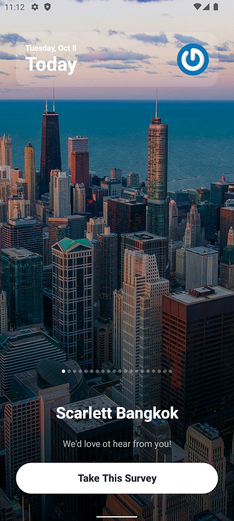

# KSurvey

## Architecture
This project follow **CLean Architecture**.

The project contains 3 modules:

1. Domain

    - This module contains business logic models of the application
    - This module define the Repository interfaces, then the higher modules can implement these interfaces
    - It also define Use Cases that handle business logic of the application using Repository interfaces

2. Data

    - This module contains Repository implementations
    - This module contains Android components (such as Network, Data Soures..) that can be used in Repository implementation

3. Presentation

    - This module handles UI parts of the application
    - This module follows MVVM pattern

The project use **Hilt** for Dependency Injection

## Libraries used

The application uses following external libraries:

1. **Coil**: to load image from remote
2. **Retrofit**: to handle HTTP requests
3. **Room**: to handle CRUD actions
4. **Lottie**: to display animation

## Implementation

### 1. UI

The application has 4 screens:

1. Splash screen

    - To display a welcome screen to user
    - To verify user's status, then navigate user to Home screen or Login screen

2. Login screen

    - To display input fields and Login button
    - This screen calls APIs to login and fetch user's info (includes tokens), then save to local storage

3. Home screen

    - To display user's info
    - To display surveys page by page
    - User can logout using the left menu
    - User can navigate to Thank you screen by clicking on button Take This Survey

4. Thank you screen

    - To display an animation
    - This page will finish in 5 seconds and back to the Home screen

### 2. Details implementation

#### 2.1. Storage of access tokens securely

- To secure the Access Token and Refresh Token, the application uses Secret Key from AndroidKeyStore to encrypt and decrypt these tokens.
- After getting the tokens from API, the application encrypts the tokens first, then save them into local storage.
- When the application need User's info (including tokens), the application will take User's info from local storage and decrypts tokens.

The implementation can be found at `.data.security.CryptoUtil`

#### 2.2. Automatic usage of refresh tokens

1. When the application launches, it checks if there are any valid Access Token (the token must be non-empty and not expires - by checking `createdAt` and `expiresIn`).
2. If NO, navigate users to Login screen.
3. If YES, the application check if the Access Token will expire soon.
4. If NO, navigate users to Home screen.
5. If YES, the application calls API to refresh the new Access Token (using `refreshToken`). Then the application save the new Access Token and Refresh Token into local storage (need to encrypt before saving). Then navigate users to Home Screen

The implementation can be found at `.domain.usecase.UserUseCase#validateUserToken`

#### 2.3. Caching of surveys

To display the surveys when there is no network connection

- The application get surveys from local storage first
- If there is no record, the application fetch surveys from the API and save them into local storage

The implementation can be found at `.data.repository.SurveyRepositoryImpl.getSurveys`

#### 2.4. Pull-to-refresh

- Surveys are getting from both local storage and API page by page (paging). So that it is not easy to handle CRUD after force refresh from API.
- I come up with a simple solution:

    - If user force refresh and the page is at index 0, the application will fetch surveys from API first
    - After getting the response successfully, the application will remove all records from local storage and save the new ones
    - After that the application will continue with the normal behavior (mentioned in section `3. Caching of surveys`)

The implementation can be found at `.data.repository.SurveyRepositoryImpl.getSurveys`

### 3. Unit Test

The project includes Unit Test for module **Data** (locate at `data/src/test`)

The Unit Test is done with `JUnit`, `Mockito`, `Mockk`

1. `LoginApiTest`
1. `LogoutApiTest`
1. `RefershTokenApiTest`
1. `FetchProfileApiTest`
1. `FetchSurveysApiTest`
1. `FetchUserDetailsApiTest`
1. `RoomUserStoreTest`
1. `RoomSurveyStoreTest`
1. `UserRepositoryImplTest`
1. `SurveyRepositoryImplTest`

## Screen record

